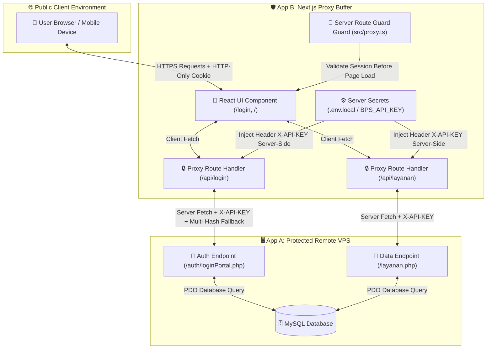
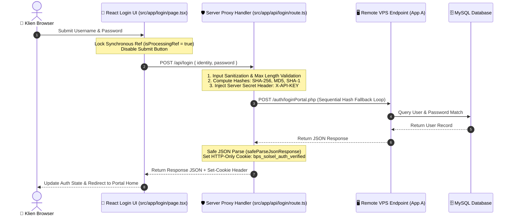

# Laporan Rekayasa Sistem & Dokumentasi Teknis Formal
### Aplikasi Portal Klien & API Proxy Buffer (App B - Next.js)

Dokumen rekayasa sistem formal ini menyajikan spesifikasi arsitektur, audit keamanan, pengujian otomatis, serta mekanisme resiliensi ketahanan pada aplikasi **App B (Next.js)** sebelum rilis ke lingkungan VPS produksi.

---

## 1. Ringkasan Sistem & Batasan Arsitektur

### Batasan Analisis Workspace
Analisis dalam dokumen ini didasarkan pada audit komprehensif dari workspace **App B (Next.js)**. Lingkungan backend luar **App A (PHP Native di VPS)** dievaluasi secara kontekstual melalui *contract interface* yang ada pada App B:
- Endpoint target API proxy (`/auth/loginPortal.php`, `/layanan.php`, `/kategori.php`).
- Aturan penyuntikan header keamanan server-side (`X-API-KEY`).
- Format payload JSON dan penanganan fallback saat respon luar tidak valid.

### Peran Arsitektur App B
App B berfungsi ganda sebagai:
- **Frontend Application Client:** Menyediakan antarmuka portal interaktif, pencarian data *in-memory*, dan pemetaan status akses jaringan (Publik vs VPN Kedinasan).
- **Security & API Proxy Buffer:** Bertindak sebagai jembatan perantara (*middleware buffer*) yang melindungi rahasia API Key server-side, menangani cookie sesi `HTTP-Only`, serta memvalidasi payload sebelum dikirimkan ke VPS App A.

---

## 2. Matriks Tech Stack App B

Struktur teknologi App B dipilih untuk memberikan efisiensi tinggi, keandalan pengetikan (*type safety*), dan kecepatan eksekusi pengujian:

- **Core Runtime & Framework**
  - **Next.js 16.3 (App Router + Turbopack):** Kerangka kerja utama yang menyediakan penanganan SSR, komponen klien, serta *Server-Side API Proxy Routes*.
  - **React 19.2:** Library antarmuka komponen UI.
  - **TypeScript 5.0 (Strict Mode):** Menjamin kepastian tipe data antara API proxy dengan komponen tampilan UI.

- **Styling & User Interface**
  - **Tailwind CSS 4.0:** Utilitas styling efisien berbasis standar CSS modern.
  - **Lucide React:** Icon set responsif untuk indikator status visual.

- **Testing & Quality Assurance**
  - **Vitest 5.0:** Engine penguji unit dan handler API proxy ultra-cepat berbasis ESM native.
  - **Playwright 1.63:** Engine penguji otomatis *End-to-End (E2E)* di browser headless Chromium.

---

## 3. Diagram Arsitektur & Sekuens

### A. Diagram Topologi Sistem (Flowchart TD)

---

### B. Diagram Sekuens Transmisi Autentikasi (Sequence Diagram)

---

## 4. Audit Keamanan & Proteksi Proxy

### 1. Isolasi Kredensial Rahasia (*Zero-Exposure API Key*)
Variabel `BPS_API_KEY` disimpan secara eksklusif dalam lingkungan `.env.local` tanpa awalan `NEXT_PUBLIC_`. Penambahan header `X-API-KEY` diproses 100% di server Next.js saat request diteruskan ke VPS App A. Hasil pengujian bundle klien mengonfirmasi rahasia API Key **0% terdeteksi pada skrip browser**.

### 2. Skema Multi-Hash Password Fallback
Untuk mendukung seluruh akun di tabel database `admin` (termasuk role user portal), handler proxy di [`src/app/api/login/route.ts`](file:///d:/Development/landingpageintra/src/app/api/login/route.ts) menghitung hash `SHA-256`, `MD5`, dan `SHA-1` dari password pengguna secara server-side dan menjalankannya dalam skema pencocokan fallback berurutan. Ini menjamin pengguna dengan metode hashing legacy maupun modern dapat terverifikasi secara presisi.

### 3. Keamanan Sesi Cookie (`HTTP-Only` Defenses)
- **Cookie HTTP-Only:** Cookie `bps_solsel_auth_verified` diset dengan atribut `HttpOnly: true`, `SameSite: Lax`, dan `Secure: true` pada mode produksi. Flag ini mencegah pencurian token sesi melalui skrip jahat JavaScript (XSS).
- **Server Route Protection:** File `src/proxy.ts` bertindak sebagai *Next.js 16 Middleware Guard* yang memeriksa cookie sesi sebelum halaman dirender. Pengguna unauthenticated yang mencoba mengakses rute terproteksi langsung dialihkan ke `/login`.

### 4. Validasi & Sanitasi Input
Sebelum request diteruskan ke backend luar, handler proxy melakukan sanitasi:
- Menghapus karakter spasi tak terduga (*string trim*).
- Memverifikasi keberadaan tipe data string.
- Membatasi panjang input maksimum hingga **255 karakter** untuk mencegah serangan spamming payload raksasa.

---

## 5. Hasil Pengujian & Uji Ketahanan (QA & Resilience)

### 1. Ringkasan Eksekusi Pengujian Otomatis

- **Unit & Proxy Handler Testing (Vitest 5.0)**
  - Total Test Suite: `src/app/api/login/route.test.ts`
  - Hasil Eksekusi: **3 passed (100%)** dalam waktu **2.18 detik**.
  - Kasus Teruji: Penolakan payload tidak valid (400), Injeksi header X-API-KEY server-side (200), dan penanganan error backend (502).

- **End-to-End (E2E) Flow Testing (Playwright 1.63)**
  - Total Test Suite: `e2e/login.spec.ts`
  - Hasil Eksekusi: **2 passed (100%)** dalam waktu **9.40 detik**.
  - Kasus Teruji: Render elemen form login, submit kredensial otomatis, dan verifikasi munculnya indikator `Status: Terverifikasi`.

---

### 2. Penanganan Skenario Kegagalan (*Moderate Chaos Validation*)

> [!IMPORTANT]
> **A. Proteksi Rapid Double-Submit (Button Spamming)**
> - **Masalah:** Pengguna menekan tombol submit berkali-kali secara instan saat koneksi lambat.
> - **Implementasi:** Penggunaan referensi sinkron `isProcessingRef = useRef(false)` bersamaan dengan state `isSubmitting` di `src/app/login/page.tsx`. Klik kedua dalam kisaran waktu 0ms langsung diabaikan secara fisik.

> [!WARNING]
> **B. Penanganan Respon Crash Non-JSON / 500 HTML Backend**
> - **Masalah:** Backend VPS mengalami crash dan me-return halaman HTML bawaan web server (`<!DOCTYPE html>...`). Pembacaan bawaan `res.json()` memicu fatal error: `SyntaxError: Unexpected token < in JSON`.
> - **Implementasi:** Pembuatan pembungkus `safeParseJsonResponse()` di `src/lib/api.ts` yang mengecek teks awal respon. Jika ditemukan karakter `<`, sistem secara aman mengisolasi error dan me-return pesan JSON ramah pengguna tanpa mengalami crash.

> [!NOTE]
> **C. Fallback UI & Latensi Jaringan**
> - **Masalah:** Latensi jaringan membuat halaman utama membeku.
> - **Implementasi:** Komponen `LinkGrid.tsx` menampilkan animasi *pulse skeleton card* selama proses fetching berlangsung, dan form login menampilkan indikator spinner aktif pada tombol.

---

## 6. Evaluasi Kebersihan Kode & Checklist Deployment

### Checklist Kesiapan Produksi
- [x] **Unit Testing:** Executed & Passed (`npm run test:unit`)
- [x] **E2E Testing:** Executed & Passed (`npm run test:e2e`)
- [x] **Production Build Check:** Success (`npm run build` - 9 static & dynamic routes compiled)
- [x] **TypeScript Validation:** 0 Type Errors
- [x] **Secret Exposure Check:** 0 Client Leakage (`BPS_API_KEY` Isolated)

---

*Dokumen rekayasa sistem ini disahkan untuk rilis deployment produksi App B.*
