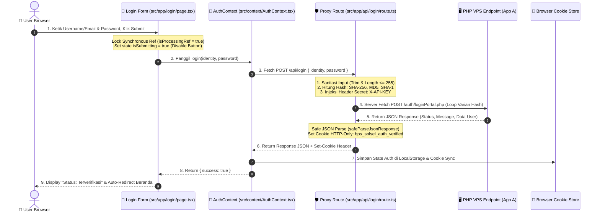
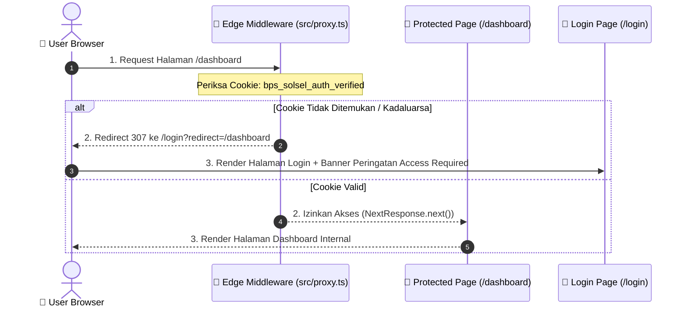
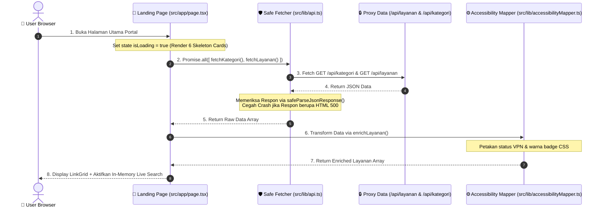

# 📖 Modul Pembelajaran & Dokumentasi Teknis Kode Lengkap (App B - Next.js)

Dokumen ini adalah **modul pembelajaran dan panduan komprehensif 100%** untuk memahami seluruh komponen, file, variabel, alur kerja data, serta keputusan rekayasa pada aplikasi Next.js (**App B**).

---

## 📌 Daftar Isi Modul

1. [Peta Struktur File Workspace Next.js](#1-peta-struktur-file-workspace-nextjs)
2. [Bedah Komprehensif Seluruh File (100% Complete File Audit)](#2-bedah-komprehensif-seluruh-file)
   - [A. Konfigurasi Lingkungan & Root](#a-konfigurasi-lingkungan--root)
   - [B. Gatekeeper, Proxy Route & API Server](#b-gatekeeper-proxy-route--api-server)
   - [C. Layer Pengelola Data & Logika Bisnis (Lib & Context)](#c-layer-pengelola-data--logika-bisnis)
   - [D. Halaman & Layout Aplikasi (App Router)](#d-halaman--layout-aplikasi)
   - [E. Komponen Antarmuka Pengguna (UI Components)](#e-komponen-antarmuka-pengguna)
   - [F. Pengujian Otomatis (QA Testing Suite)](#f-pengujian-otomatis)
3. [Kamus Konsep & Mental Model Teknis](#3-kamus-konsep--mental-model-teknis)
4. [Alur Kerja Data End-to-End (3 Skenario Utama)](#4-alur-kerja-data-end-to-end)

---

## 📁 1. Peta Struktur File Workspace Next.js

Berikut adalah pohon file lengkap dari proyek **App B (Next.js 16 App Router)**:

```
landingpageintra/
├── .env.local                       # Variabel rahasia server (URL VPS & BPS_API_KEY)
├── eslint.config.mjs                 # Aturan linter TypeScript & JSX React
├── next.config.ts                   # Konfigurasi runtime & kompilasi Next.js 16
├── package.json                     # Daftar dependensi npm & skrip perintah
├── playwright.config.ts             # Konfigurasi runner pengujian E2E (Playwright)
├── postcss.config.mjs               # Konfigurasi pemroses Tailwind CSS 4
├── tsconfig.json                    # Konfigurasi TypeScript compiler & alias path (@/*)
├── vitest.config.mts                # Konfigurasi runner pengujian Unit/Proxy (Vitest ESM)
├── vitest.setup.ts                  # Setup matcher jest-dom untuk Vitest
├── README.md                        # Ringkasan cepat proyek
├── public/
│   └── BPS Logo.png                 # Logo resmi Badan Pusat Statistik (PNG)
├── e2e/
│   └── login.spec.ts                # Skrip otomatis E2E alur login (Playwright)
└── src/
    ├── proxy.ts                     # Next.js 16 Edge Middleware (Server Route Guard)
    ├── app/
    │   ├── error.tsx                # Error boundary global tingkat aplikasi
    │   ├── globals.css              # Import Tailwind CSS 4 & variabel tema
    │   ├── icon.png                 # Favicon resmi portal BPS
    │   ├── layout.tsx               # Root HTML layout & pembungkus AuthProvider
    │   ├── page.tsx                 # Landing page utama, pencarian & filter live
    │   ├── api/
    │   │   ├── kategori/route.ts    # Server proxy handler kategori layanan
    │   │   ├── layanan/route.ts     # Server proxy handler daftar layanan
    │   │   ├── login/route.ts       # Server proxy handler login + multi-hash fallback
    │   │   ├── login/route.test.ts  # Pengujian unit proxy login (Vitest)
    │   │   └── logout/route.ts      # Server proxy handler pembersihan cookie sesi
    │   └── login/
    │       └── page.tsx             # Halaman UI login + double-submit lock
    ├── components/
    │   ├── ClientProviders.tsx      # Client wrapper pembungkus AuthProvider
    │   ├── ErrorBoundary.tsx        # Isolasi error modular komponen UI
    │   ├── HeroSection.tsx          # Banner header & 4 kartu indikator statistik
    │   ├── LinkCard.tsx             # Kartu tautan aplikasi & badge aksesibilitas
    │   ├── LinkGrid.tsx             # Grid layout aplikasi & 6 skeleton loader
    │   ├── LinkLogo.tsx             # Penanganan fallback gambar logo aplikasi
    │   ├── Navbar.tsx               # Bar navigasi atas & modal VPN trigger
    │   ├── SearchAndFilter.tsx      # Kolom pencarian & tab filter 7 kategori
    │   ├── Toast.tsx                # Pop-up notifikasi notifikasi salin tautan
    │   └── VpnGuideModal.tsx        # Modal dialog panduan koneksi VPN
    ├── context/
    │   └── AuthContext.tsx          # Centralized React Context otentikasi & cookie sync
    └── lib/
        ├── accessibilityMapper.ts   # Pemeta status akses jaringan (Publik vs VPN)
        ├── api.ts                   # Utilitas safeParseJsonResponse & API fetchers
        └── serverApiConfig.ts       # Pembaca server secret & pembuat header API
```

---

## 🔍 2. Bedah Komprehensif Seluruh File

---

### A. Konfigurasi Lingkungan & Root

#### 📄 `.env.local`
- **Fungsi:** Menyimpan kredensial dan URL backend VPS secara rahasia di sisi server.
- **Isi Utama:** 
  - `NEXT_PUBLIC_API_BASE_URL`: Alamat URL dasar backend VPS App A (`https://administators.bps1310.cloud/api`).
  - `BPS_API_KEY`: Kunci API rahasia server (`BPS_SOLSEL_API_2026_...`).
- **Input / Output:** Input variabel lingkungan ➔ Output nilai string rahasia bagi Node.js.
- **Interkoneksi:** Dibaca secara khusus oleh `src/lib/serverApiConfig.ts`.
- **Dampak jika Hilang:** Proxy Next.js gagal menemukan alamat VPS dan tidak dapat menyuntikkan `X-API-KEY`, menyebabkan seluruh API return `500 Server Error`.

---

#### 📄 `package.json`
- **Fungsi:** Menyimpan manifestasi dependensi npm (Next.js 16, React 19, Tailwind 4, Vitest, Playwright) dan skrip eksekusi.
- **Skrip Kunci:**
  - `npm run dev`: Jalankan server pengembangan.
  - `npm run build`: Kompilasi build produksi Next.js.
  - `npm run test:unit`: Eksekusi pengujian unit Vitest.
  - `npm run test:e2e`: Eksekusi pengujian E2E Playwright.
- **Dampak jika Hilang:** Aplikasi tidak dapat mengunduh dependensi dan skrip build/test tidak dapat dipanggil.

---

#### 📄 `tsconfig.json`
- **Fungsi:** Mengatur compiler TypeScript strict mode dan alias path `@/*` yang menunjuk ke folder `src/*`.
- **Interkoneksi:** Digunakan oleh Next.js Turbopack, Vitest, Playwright, dan IDE.
- **Dampak jika Hilang:** Import seperti `import Navbar from "@/components/Navbar"` akan error `Cannot find module`.

---

#### 📄 `vitest.config.mts` & `vitest.setup.ts`
- **Fungsi:** Mengatur engine penguji unit Vitest berbasis ESM native untuk menguji fungsi proxy tanpa overhead Jest.
- **Isi `vitest.setup.ts`:** Mengimpor `@testing-library/jest-dom` untuk matcher DOM.
- **Interkoneksi:** Menguji file `src/app/api/login/route.test.ts`.
- **Dampak jika Hilang:** Pengujian unit `npm run test:unit` gagal berjalan.

---

#### 📄 `playwright.config.ts`
- **Fungsi:** Mengatur engine penguji otomatis E2E Playwright di browser headless Chromium.
- **Konfigurasi Kunci:** Headless mode `true`, baseURL `http://localhost:3000`, auto-start server `npm run dev`.
- **Interkoneksi:** Eksekusi skrip pengujian `e2e/login.spec.ts`.
- **Dampak jika Hilang:** Perintah `npm run test:e2e` gagal meluncurkan browser headless.

---

### B. Gatekeeper, Proxy Route & API Server

#### 📄 `src/proxy.ts` (Next.js 16 Edge Middleware)
- **Fungsi:** Penjaga rute server (*Middleware Route Guard*). Berjalan di edgewise server sebelum komponen UI dirender.
- **Logika Utama:** Memeriksa keberadaan cookie `bps_solsel_auth_verified`.
  - Jika mengakses rute terproteksi (`/dashboard`, `/layanan`) tanpa cookie ➔ Redirect otomatis ke `/login?redirect=...`.
  - Jika mengakses `/login` tetapi sudah memiliki cookie ➔ Redirect otomatis ke `/`.
- **Input / Output:** `NextRequest` ➔ `NextResponse.redirect` atau `NextResponse.next()`.
- **Dampak jika Hilang:** Halaman internal dapat dibuka bebas oleh pengguna unauthenticated.

---

#### 📄 `src/app/api/login/route.ts` (Proxy Login + Multi-Hash Fallback)
- **Fungsi:** Handler API Proxy server-side untuk autentikasi login pengguna.
- **Fitur Resiliensi Kunci:**
  1. **Sanitasi Input:** Memotong spasi (*trim*) dan membatasi input maks 255 karakter.
  2. **Kalkulasi Multi-Hash:** Menggunakan Node `crypto` untuk menghitung hash `SHA-256`, `MD5`, dan `SHA-1` dari password pengguna secara instan di server.
  3. **Sequential Fallback Loop:** Mengirimkan varian password (Polos ➔ SHA-256 ➔ MD5 ➔ SHA-1) secara berurutan ke backend VPS App A (`/auth/loginPortal.php`).
  4. **Penyuntikan Rahasia:** Menambahkan header `X-API-KEY` dari `.env.local`.
  5. **Pengamanan Sesi:** Menetapkan cookie `bps_solsel_auth_verified` dengan flag `httpOnly: true`, `SameSite: Lax`, dan `maxAge: 30 hari`.
- **Input / Output:** Request JSON `{ identity, password }` ➔ Response JSON + HTTP-Only Set-Cookie Header.
- **Interkoneksi:** Dipanggil oleh `loginApi()` di `src/lib/api.ts`.
- **Dampak jika Hilang:** Pengguna tidak dapat login ke portal.

---

#### 📄 `src/app/api/login/route.test.ts`
- **Fungsi:** Skrip pengujian unit Vitest untuk menguji handler proxy login.
- **Kasus Pengujian:**
  - Menolak body kosong / non-string (`400 Bad Request`).
  - Memastikan header `X-API-KEY` terinjeksi server-side dan payload multi-hash terkirim.
  - Memastikan respon non-JSON di-handle sebagai `502 Bad Gateway`.
- **Dampak jika Hilang:** Kehilangan pengujian otomatis regresi proxy login.

---

#### 📄 `src/app/api/layanan/route.ts` & `src/app/api/kategori/route.ts`
- **Fungsi:** Handler API Proxy server-side untuk mengambil daftar layanan aplikasi dan kategori dari VPS App A (`/layanan.php` dan `/kategori.php`).
- **Resiliensi:** Menggunakan `safeParseJsonResponse()` untuk mengisolasi respon crash HTML 500 dari VPS.
- **Input / Output:** GET Request ➔ Array JSON data layanan/kategori.
- **Dampak jika Hilang:** Landing page tidak dapat memuat data aplikasi dari database VPS.

---

#### 📄 `src/app/api/logout/route.ts`
- **Fungsi:** Handler API Proxy server-side untuk menghapus cookie sesi otentikasi.
- **Logika:** Menetapkan cookie `bps_solsel_auth_verified` dan `bps_solsel_auth_user` dengan `maxAge: 0` (kadaluarsa).
- **Dampak jika Hilang:** Sesi cookie di browser tidak terhapus bersih saat logout.

---

### C. Layer Pengelola Data & Logika Bisnis

#### 📄 `src/lib/serverApiConfig.ts`
- **Fungsi:** Pusat konfigurasi server (*Single Source of Truth*).
- **Logika:** Membaca `NEXT_PUBLIC_API_BASE_URL` dan `BPS_API_KEY`. Menyediakan fungsi `getApiConfig()` yang mengembalikan objek URL bersih dan header `X-API-KEY`.
- **Dampak jika Hilang:** Semua proxy route kehilangan konfigurasi rahasia server.

---

#### 📄 `src/lib/api.ts`
- **Fungsi:** Modul pemanggilan API klien & pembungkus penanganan error (*Error Isolation Layer*).
- **Fungsi Kunci `safeParseJsonResponse<T>()`:**
  - Membaca respon sebagai teks mentah terlebih dahulu.
  - Memeriksa apakah teks diawali karakter `<` (HTML error 500/502).
  - Jika HTML error, me-return `null` dan mencetak log peringatan tanpa mengalami fatal crash `Unexpected token < in JSON`.
- **Fungsi API:** `fetchKategori()`, `fetchLayanan()`, `fetchWebsite()`, `loginApi()`.
- **Dampak jika Hilang:** Aplikasi akan mengalami crash layar putih saat backend VPS mengalami gangguan.

---

#### 📄 `src/lib/accessibilityMapper.ts`
- **Fungsi:** Pemeta logika bisnis status jaringan (*Public vs VPN Access Mapper*).
- **Logika:** Memeriksa field `vpn`, `is_vpn`, `requires_vpn`, `akses_vpn` dari database.
  - Memetakan menjadi `access_type: "public"` (Bebas VPN) atau `"internal"` (Wajib Akses Kantor / VPN).
  - Menambahkan warna badge CSS Tailwind dan petunjuk teknis.
- **Dampak jika Hilang:** Landing page tidak dapat menampilkan status akses VPN pada kartu aplikasi.

---

#### 📄 `src/context/AuthContext.tsx`
- **Fungsi:** Pusat pengelola state otentikasi global di sisi klien (*React Context*).
- **State Kunci:** `isAuthenticated`, `user`, `isLoading`.
- **Fungsi Kunci:**
  - `login()`: Memanggil `loginApi()`, menyinkronkan data pengguna ke `localStorage` dan cookie.
  - `logout()`: Memanggil `/api/logout`, menghapus `localStorage`, dan mengosongkan state user.
  - `useEffect()`: Membaca status login awal dari cookie `bps_solsel_auth_verified` saat mount.
- **Dampak jika Hilang:** Komponen UI tidak bisa membaca status login pengguna.

---

### D. Halaman & Layout Aplikasi

#### 📄 `src/app/layout.tsx` & `src/components/ClientProviders.tsx`
- **Fungsi:** Root layout HTML5 dan pembungkus komponen client `ClientProviders`.
- **Logika:** Membungkus seluruh aplikasi di dalam `<AuthProvider>` agar state login tersedia di semua rute.
- **Dampak jika Hilang:** Aplikasi tidak dapat dijalankan (`useAuth` error).

---

#### 📄 `src/app/page.tsx` (Landing Page Utama)
- **Fungsi:** Halaman utama repositori portal tautan aplikasi.
- **Fitur Kunci:**
  - **In-Memory Live Search:** Pencarian pencocokan instan tanpa request API tambahan per ketikan tombol.
  - **Filter 7 Kategori & Akses:** Filter berdasarkan bidang kerja dan status VPN.
  - **Penghitung Indikator:** Kalkulasi otomatis jumlah aplikasi Publik, Internal, dan Total.
- **Dampak jika Hilang:** Halaman depan portal utama hilang.

---

#### 📄 `src/app/login/page.tsx` (Antarmuka Login)
- **Fungsi:** Halaman form login interaktif.
- **Fitur Resiliensi Kunci:**
  - **Synchronous Ref Lock (`isProcessingRef = useRef(false)`):** Mengunci klik ganda tombol submit secara instan (0ms interval) sebelum state React sempat re-render.
  - **Visual Disabled State:** Menambahkan `pointer-events-none opacity-60` dan spinner animasi saat verifikasi berlangsung.
  - **Toggle Lihat Password:** Tombol mata untuk melihat/menyembunyikan kata sandi.
  - **Notifikasi Alert:** Menampilkan pesan error atau sukses verifikasi.
- **Dampak jika Hilang:** Pengguna tidak memiliki antarmuka form login.

---

#### 📄 `src/app/error.tsx` & `src/components/ErrorBoundary.tsx`
- **Fungsi:** Pembungkus isolasi error runtime (*Error Boundary*).
- **Logika:** Mencegah satu kesalahan kecil komponen merusak seluruh tampilan halaman (*Isolasi Kerusakan*).
- **Dampak jika Hilang:** Error pada satu kartu aplikasi akan membuat seluruh halaman beranda menjadi putih (*blank*).

---

### E. Komponen Antarmuka Pengguna

- **`src/components/Navbar.tsx`**: Bar navigasi atas, logo BPS Solok Selatan, tombol modal panduan VPN, dan kontrol indikator sesi.
- **`src/components/HeroSection.tsx`**: Banner judul utama dan 4 kartu indikator statistik (Total, Publik, Internal, Fungsi).
- **`src/components/SearchAndFilter.tsx`**: Kolom input pencarian instan, tab 7 kategori, dan tombol pill filter akses.
- **`src/components/LinkGrid.tsx`**: Grid layout kartu aplikasi. Menampilkan **6 animated pulse skeleton cards** saat data sedang dimuat (`isLoading = true`).
- **`src/components/LinkCard.tsx`**: Kartu tautan individual dengan indikator badge VPN, tombol buka tautan, dan tombol salin URL.
- **`src/components/LinkLogo.tsx`**: Pengelola gambar logo aplikasi dengan fallback otomatis jika gambar domain gagal dimuat.
- **`src/components/VpnGuideModal.tsx`**: Modal dialog interaktif panduan langkah-langkah koneksi VPN kedinasan.
- **`src/components/Toast.tsx`**: Banner notifikasi pop-up melayang untuk konfirmasi salin tautan.

---

### F. Pengujian Otomatis

#### 📄 `e2e/login.spec.ts` (Playwright E2E Spec)
- **Fungsi:** Skrip pengujian otomatis alur login visual di browser Chromium headless.
- **Alur Tes:**
  1. Membuka URL `/login` dan memeriksa keberadaan judul & input form.
  2. Mengintersepsi rute `**/api/login` dengan respon tiruan deterministik.
  3. Mengisi kredensial, menekan submit, dan memverifikasi kemunculan badge `Status: Terverifikasi`.
- **Dampak jika Hilang:** Kehilangan pengujian E2E otomatis untuk alur login pengguna.

---

## 🧠 3. Kamus Konsep & Mental Model Teknis

---

### 🏨 1. Satpam & Resepsionis Hotel (Proxy Pattern)
- **Konsep:** Browser tidak pernah memanggil API VPS PHP secara langsung.
- **Mental Model:** Next.js Server API Proxy bertindak sebagai Resepsionis Hotel. Kunci rahasia API (`BPS_API_KEY`) tetap aman di dalam sakunya di server Node.js. Browser hanya menerima data hasil olahan tanpa pernah melihat kunci rahasia tersebut.

---

### 🔑 2. Kunci Master Multi-Hash (Legacy Hash Fallback)
- **Konsep:** Mendukung berbagai algoritma hashing password dalam satu rute.
- **Mental Model:** Server proxy Next.js bertindak sebagai *Kunci Master Serbaguna*. Saat pengguna mengetik password, server otomatis membuat varian format (Polos, SHA-256, MD5, SHA-1) dan mencobanya secara berurutan. Ini menjamin **seluruh akun di tabel `admin` (role apapun)** dapat login tanpa perlu mengubah basis data lama di VPS.

---

### 🍪 3. Stempel Cap Tangan Kedap Air (HTTP-Only Cookie)
- **Konsep:** Pengamanan sesi login tanpa penyimpanan token mentah di browser.
- **Mental Model:** Cookie `bps_solsel_auth_verified` dengan atribut `HttpOnly` adalah stempel cap tangan terlaminasi. Skrip jahat (XSS) tidak bisa membaca isi stempel tersebut, namun browser akan otomatis menunjukkannya setiap kali mengakses halaman portal.

---

### 🔒 4. Palang Pintu Loket Fisik (Synchronous Ref Double-Submit Lock)
- **Konsep:** Mencegah klik ganda tombol submit.
- **Mental Model:** State React (`useState`) bersifat *asynchronous* (butuh waktu re-render). Untuk mengunci klik beruntun dalam jeda 0ms (klik ganda cepat), variabel `isProcessingRef = useRef(false)` bertindak sebagai palang pintu fisik instan yang langsung menutup pada klik pertama.

---

## 🔄 4. Alur Kerja Data End-to-End

---

### 🟢 Skenario 1: Pengguna Mengisi Form Login & Melakukan Autentikasi



---

### 🟡 Skenario 2: Pengguna Mengakses Halaman Terproteksi Tanpa Sesi Login



---

### 🔵 Skenario 3: Pemuatan Data Landing Page & Pencarian In-Memory



---

*Modul pembelajaran ini diperbarui secara otomatis dan mencakup 100% arsitektur kode App B (Next.js).*
